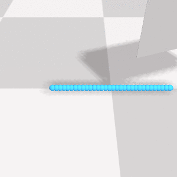
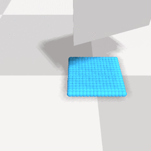
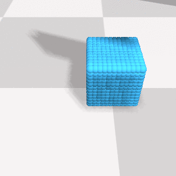
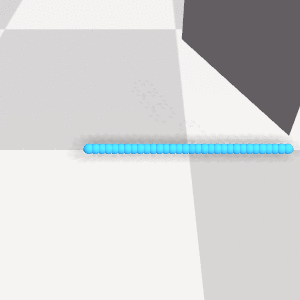
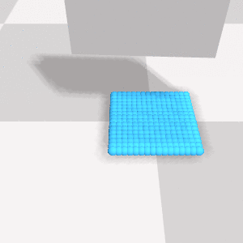
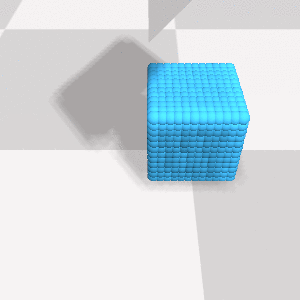
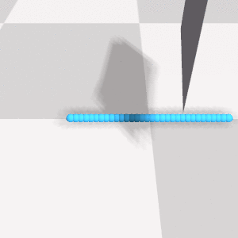
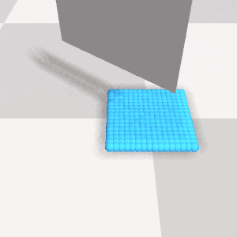
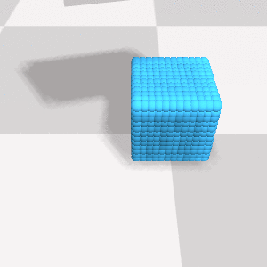

# SoftGym
<a href="https://sites.google.com/view/softgym/home">SoftGym</a> is a set of benchmark environments for deformable object manipulation including tasks involving fluid, cloth and rope. It is built on top of the Nvidia FleX simulator and has standard Gym API for interaction with RL agents. 

## Using Docker
The provided Dockerfile is based on the [pre-built image for softgym](https://hub.docker.com/layers/xingyu/softgym/latest/images/sha256-29a9f674cf3527e645a237facdfe4b5634c23cd0f1522290e0a523308435ccaa?context=explore) which in turn uses CUDA 9.2. This codebase is tested with Ubuntu 20.04 LTS and Nvidia driver version 450.102.04

## Prerequisites

- Install [docker-ce](https://docs.docker.com/install/linux/docker-ce/ubuntu/)
- Install [nvidia-docker](https://github.com/NVIDIA/nvidia-docker#quickstart) (Docker versions earlier than 19.03 require nvidia-docker2 and the `--runtime=nvidia` flag. On versions including and after 19.03, you will use the `nvidia-container-toolkit` package and the `--gpus all` flag)

## Building and running Dockerfile

1. run `make build` to build the docker image
2. run `make bash` to run the image with an interactive bash session (step 2 also includes step 1)
3. run `source setup.sh` to setup the `softgym conda environment` and compile the python bindings for `pyflex`
 
## SoftGrid cutting environment with configurable initial knife pose
| 1D particle grid | 2D particle grid | 3D particle grid |
|---------------------------|-----------------------------|-----------------------------|
||  |  |
||  |  |
||  |  |

To generate a set of cutting rollouts run:  
`python softbody_grid_cutting/cutting_env.py`

For example, running:  
`python softbody_grid_cutting/cutting_env.py --render 1 --save_frames 1 --n_rollout 100 --dimz 12 --dimx 12 --dimy 12 --data_dir softbody_grid_cutting/examples`
would generate 100 rollouts of a 12x12x12 particle grid and would store the particle data, together with the rendered frames, under `softbody_grid_cutting/examples` 

To list the different parameters that can be used to configure the data-generation script, run:  
`python softbody_grid_cutting/cutting_env.py --help`  

## References
- NVIDIA FleX - 1.2.0: https://github.com/NVIDIAGameWorks/FleX
- Our python interface builds on top of PyFleX: https://github.com/YunzhuLi/PyFleX
