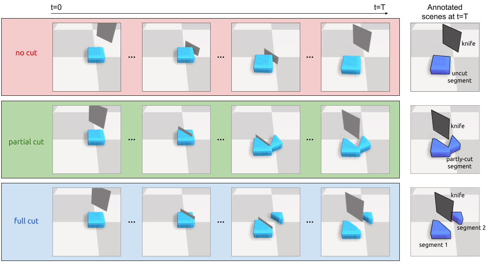

# CutBench: Evaluating Soft Body Dynamics Learning Methods in Cutting Actions (CoRL 2021)

## About

**CutBench** is a suite of simulated cutting benchmark tasks, and a corresponding set of evaluation metrics which measure how well a candidate data-driven model can successfully replicate the physical phenomena of cutting.

Project Website: [CutBench: Evaluating Soft Body Dynamics Learning Methods in Cutting Actions](https://sites.google.com/view/cutbench/homepage)

## Introduction

CutBench can facilitate simulating a variety of knife-body interactions. As we can see in the following image, CutBench can simulate scenarios where:
1. the knife only pushes a body without affecting its integrity (top)
2. the knife partly cuts a body (middle)
3. the knife completely separates the original body into two smaller ones which are separated as the knife pushes one to the side (bottom).

Scenarios where the knife simply cuts through the body, without any follow-up pushing action can also be simulated.



### Demo

CutBench original intent is to provide researchers with an environment where they can study the performance of soft body dynamics learning methods in scenarios with cutting actions.

Currently _(Summer 2021)_, there is a lack of models which simulate the entire holistic process of cutting. A CutBench case-study using [DPI-Net](http://dpi.csail.mit.edu/) to model the dynamics of a soft body following a cutting action, is indicative of this scarcity and can provide insights about where robotic cutting research endeavors should focus, in the near future.

  

  

## Setup

TODO: How to get CutBench up and running.

### Dependencies

TODO: What you should download to get started.

### Environment preparation

To prepare the environment, simply launch the Docker container with ``[sudo] make bash`` and ``source setup.sh``.

## Generating a dataset

By choosing the right parameter values, CutBench enables simulating a range of cutting scenarios, featuring:
* _quick_ or _slow_ cuts
* _loose_ or _stiff_ bodies
* _sharp_ or _blunt_ knives

### Scene parameterization options

``cutting_env.py`` exposes a number of simulation parameters to the user, which are documented in the code of the ``main()`` function.

An example dataset generation parameterization can be found in the ``gen_grid_cutting_dataset.sh`` script:

```bash
python  softbody_grid_cutting/cutting_env.py \
        --n_rollout=3 \                 # generate 3 simulation rollouts
        --rollout_len=30 \              # each rollout consists of 30 timesteps (frames)
        --render=1 \                    # render timesteps (visualize simulation)
        --save_frames=1 \               # save frames as images
        --dimx=10 --dimy=5 --dimz=10 \  # dimensions of the body in particles, here we have a 10x5x10 box, dimy is the height in particles
        --pulling_dist=10 \             #
        --type_of_cut="partial cut"     # "no cut"/ "full cut" / "partial cut" / "just cut", depending on what we want to do with the body
```

#### Note

_Partial cut_ and _No cut_ datasets are generated by rejection sampling over the cuts that result from randomly sampled knife poses.

### Inspecting dataset

The resulting dataset will be in the directory defined by the relative path of the ``data_dir`` parameter. Inside this directory we have the directories of the rollouts ``0/, 1/, ... , [n_rollout-1]/``, each containing the respective timesteps ``0.h5, 1.h5, ... , [rollout_len-1].h5``. We also have the ``stat.h5`` file, containing basic dataset statistics, like mean and std of particle positions.

### Splitting dataset to training & validation sets

Most dynamics learning methods require the dataset to be inserted already split in a training and a validation directory (e.g. ``train/`` and ``valid/``), given a train-valid ratio. To simplify this process over the generated dataset, we wrote the ``split_dataset.py`` script.

An example dataset splitting parameterization can be found in the ``split_dataset.sh`` script:

```bash
python  softbody_grid_cutting/split_dataset.py \
        --rollout_n=200 \               # original dataset had 200 rollout (total)
        --train_valid_ratio=0.9 \       # split original dataset with a 0.9 train-valid ratio, so 200 roll total --> 180 train roll and 20 valid roll
        --unsplit_data_dir=softbody_grid_cutting/data_partial_cut \     # path where original dataset is stored
        --split_data_dir=softbody_grid_cutting/data_CutSoftGrid_3D_500p_mixed_reactive_body_partial_cuts_17-06  # path where split dataset is stored

```

## Citing CutBench

If you find this codebase useful, please consider citing:

> Citation placeholder
