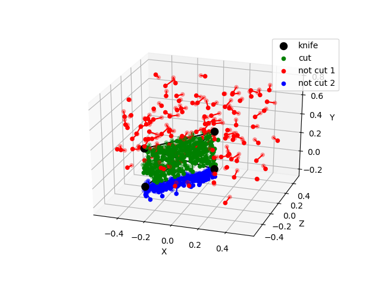
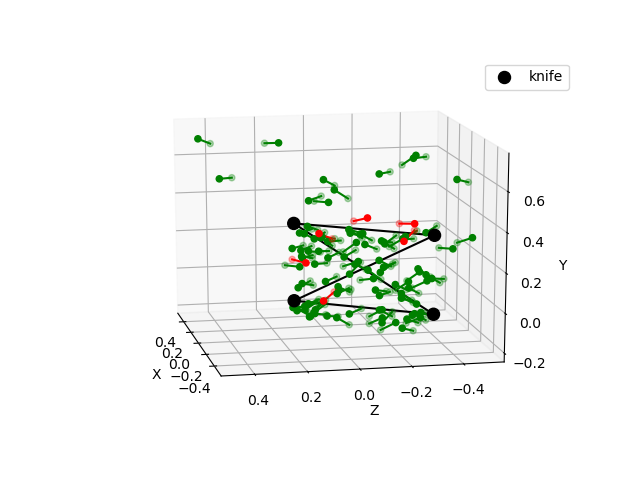

# Intersection Encoder

An Encoder module, acting as a binary classifier, which implements the linear algebra cutting logic that was handcrafted for data generation.

* **Inputs:** _Particle_1 pose_, _Particle_2 pose_, _{Knife pose}_
  * Being a plane, knife pose can be described by the poses of 4 particles
* **Output:** Does the line connecting the 2 particles intersect the plane?

Source: [Line-plane intersection - Wikipedia](https://en.wikipedia.org/wiki/Line%E2%80%93plane_intersection)

## Logic Demo

## Evaluation Demo

